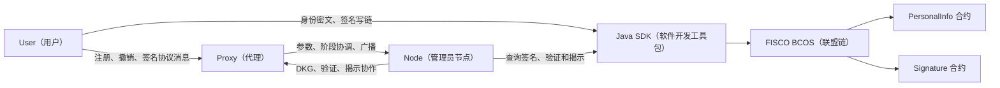
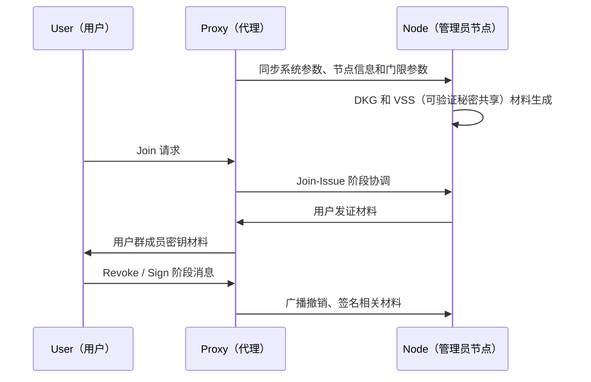
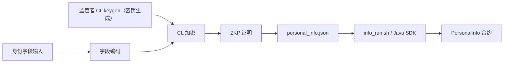
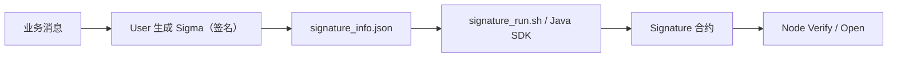
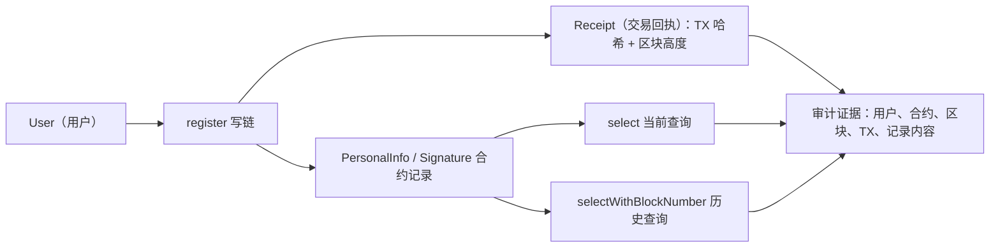

# 架构说明

本文说明 GS-TBK（Group Signatures with Time-bound Keys，带时间绑定密钥的群签名方案）分布式身份监管系统的角色关系、链端集成方式和两条核心数据流。它是 `README.md` 与 `docs/operations/README.md` 之间的结构说明，不替代协议论文或源码注释。

## 角色与边界

- User（用户）：持有用户私钥和身份字段，负责加入、签名、身份密文生成和链端写入。
- Proxy（代理）：维护系统参数、时间树、群公钥、用户和节点列表，是 User 与 Node 的协调入口。
- Node（管理员节点）：多个节点共同完成 DKG（Distributed Key Generation，分布式密钥生成）、注册、撤销、验证和 Open（揭示）。
- Java SDK（Software Development Kit，软件开发工具包）：连接 FISCO BCOS（金融区块链合作联盟开源区块链底层平台），调用合约 wrapper（包装类）。
- contracts（智能合约）：`PersonalInfo` 保存身份密文和证明材料，`Signature` 保存用户签名 JSON（JavaScript Object Notation，数据交换格式）。

## 总体拓扑



## 协议控制流

User、Proxy 和 Node 的协议消息仍由 Rust 侧测试入口驱动。当前默认拓扑是 1 个 Proxy、4 个 Node、最多 6 个 User：



## 身份字段加密数据流

身份字段处理由 `crates/id_info_process` 与 `crates/cl_encrypt` 完成。CL（Castagnos-Laguillaumie，同态加密方案）原生库生成密文，ZKP（Zero-Knowledge Proof，零知识证明）证明密文与身份字段处理逻辑一致。



运行入口：

```bash
bash scripts/run-local/run-id-info.sh keygen
bash scripts/run-local/run-id-info.sh enc
```

链端接入点：

- Rust 侧读取 `GSTBK_PERSONAL_INFO_APP_DIR`。
- 该目录需要包含 `info_run.sh`。
- 当前 Java SDK 工程已提交 wrapper 和 `info_run.sh` 包装脚本，可替代历史服务器脚本。

## 签名上链数据流

签名数据由 User 生成，经 Rust 侧脚本调用链端应用写入 `Signature` 合约。Node 在 Verify（验证）和 Open 阶段通过同一路径查询链上签名。



链端接入点：

- User 写链读取 `GSTBK_SIGNATURE_APP_DIR`，目录下需要有 `signature_run.sh`。
- Node 查询签名也读取 `GSTBK_SIGNATURE_APP_DIR`。
- `GSTBK_SIGNATURE_CONTRACT_ADDRESS` 是部署后的真实合约地址，保存在本地 `.env` 或 VM 配置中，不提交到仓库。

## 审计追溯数据流

链上审计查询围绕 `PersonalInfo` 与 `Signature` 两类记录展开。User 写链后，Java SDK 会从交易回执中输出 TX（Transaction，交易）哈希和区块高度；后续监管方或 Node 可通过 `select` 查询当前记录，通过 `history` / `selectWithBlockNumber`（按区块高度历史查询）追溯指定区块时的历史记录。



当前可复核入口：

- `bash chain-apps/fisco-bcos-java-sdk/signature_run.sh select <contractAddress> <user>`
- `bash chain-apps/fisco-bcos-java-sdk/signature_run.sh history <contractAddress> <user> <blockNumber>`
- `bash chain-apps/fisco-bcos-java-sdk/info_run.sh select <contractAddress> <user>`
- `bash chain-apps/fisco-bcos-java-sdk/info_run.sh history <contractAddress> <user> <blockNumber>`
- `bash scripts/evidence/run-audit-query-demo.sh --manifest <manifest.json>`

审计 demo（演示）和判读口径见 `docs/evidence/audit-query-demo.md`。

## Java SDK 与合约关系

`chain-apps/fisco-bcos-java-sdk` 当前已对齐 FISCO BCOS v3.6.0 Java SDK，并提交生成后的合约 wrapper。真实部署和调用仍需要本地或 VM 环境提供：

- `chain-apps/fisco-bcos-java-sdk/conf/config.toml`。
- 真实证书、账户和私钥材料。
- `GSTBK_PERSONAL_INFO_CONTRACT_ADDRESS` 与 `GSTBK_SIGNATURE_CONTRACT_ADDRESS`。

这些运行材料均属于本地或 VM 环境，不进入 Git（分布式版本控制系统）提交。
